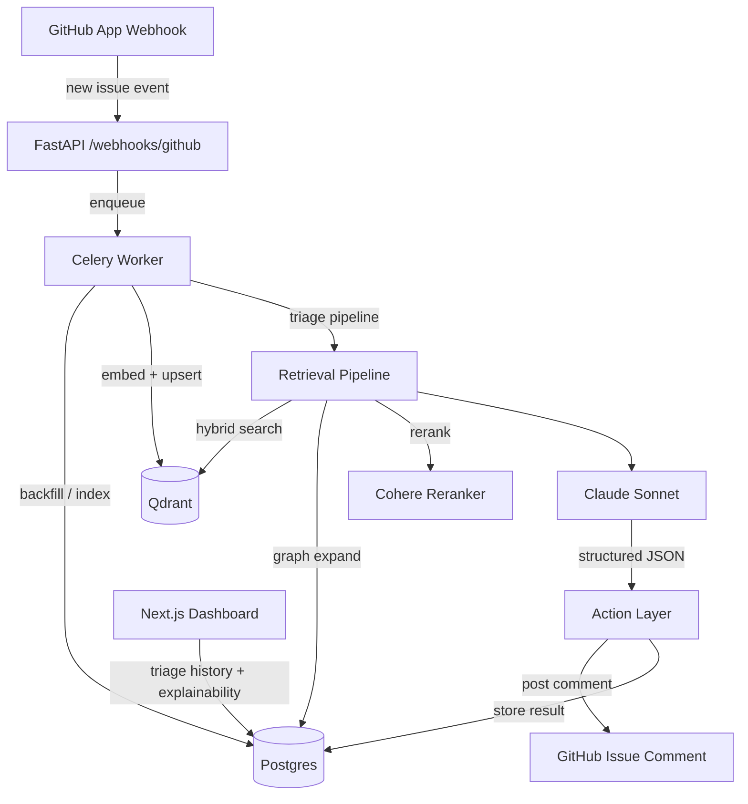

# TriageCopilot

> Graph-aware RAG GitHub issue triage assistant. Automatically triages new issues with duplicate detection, label suggestions, relevant file identification, and assignee suggestions — all with cited reasoning.

## Architecture



## Tech Stack

| Layer | Technology |
|---|---|
| Backend | FastAPI + Celery + Redis |
| Database | Postgres 15 + SQLAlchemy 2.0 + Alembic |
| Vector DB | Qdrant (self-hosted) |
| Embeddings | voyage-code-3 / text-embedding-3-large (fallback: bge-large-en) |
| Reranker | Cohere Rerank v3 (fallback: bge-reranker-large) |
| LLM | Claude Sonnet (Anthropic API) |
| Code Parsing | tree-sitter (Python, JS, TS, Go) |
| Frontend | Next.js 14 + Tailwind + shadcn/ui |

## Local Setup

### Prerequisites

- Docker + Docker Compose
- Python 3.11+
- A GitHub App (see registration instructions below)

### 1. Clone and configure

```bash
git clone https://github.com/YOUR_USERNAME/triage-copilot
cd triage-copilot
cp .env.example .env
# Edit .env and fill in GITHUB_APP_ID, GITHUB_WEBHOOK_SECRET, ANTHROPIC_API_KEY
```

### 2. Register the GitHub App

1. Go to **GitHub → Settings → Developer settings → GitHub Apps → New GitHub App**
2. Set the following:
   - **GitHub App name:** `TriageCopilot-dev` (must be unique)
   - **Homepage URL:** `http://localhost:8000`
   - **Webhook URL:** Use your smee.io proxy URL (see step 4)
   - **Webhook secret:** Generate a random secret (`openssl rand -hex 32`) and set it in `.env` as `GITHUB_WEBHOOK_SECRET`
   - **Permissions → Repository permissions:**
     - Issues: Read & Write
     - Pull requests: Read
     - Contents: Read
     - Metadata: Read
   - **Subscribe to events:** Issues, Pull request, Push, Installation
3. Click **Create GitHub App**
4. Note your **App ID** → set as `GITHUB_APP_ID` in `.env`
5. Scroll to **Private keys** → **Generate a private key** → download the `.pem` file
6. Copy it: `mkdir -p certs && cp ~/Downloads/*.pem certs/github-app.pem`
7. Set `GITHUB_PRIVATE_KEY_PATH=./certs/github-app.pem` in `.env`

### 3. Set up smee.io proxy (for local webhook delivery)

```bash
npm install --global smee-client
# Create a new channel at https://smee.io → copy the URL
smee --url https://smee.io/YOUR_CHANNEL_ID --target http://localhost:8000/webhooks/github
```

Set the smee.io URL as the **Webhook URL** in your GitHub App settings.

### 4. Start services

```bash
docker compose up -d postgres redis qdrant
```

### 5. Run database migrations

```bash
cd backend
pip install -e ".[dev]"
alembic upgrade head
```

### 6. Start the backend

```bash
cd backend
uvicorn app.main:app --reload
```

Or run everything via Docker:

```bash
docker compose up
```

### 7. Install the GitHub App on a test repo

Go to your GitHub App → **Install App** → choose a repository. You should see an `installation` webhook arrive in your smee.io channel and a `202` response from the backend.

## Running Tests

```bash
cd backend
pytest tests/ -v
```

## Evaluation

```bash
# Day 7+: run the eval harness against labeled historical issues
cd eval
python run_eval.py --repo owner/repo --output results.md
```

## Deployment

- **Backend:** Railway (`railway up` from `/backend`)
- **Qdrant:** Hetzner VPS (`docker compose -f docker-compose.prod.yml up -d qdrant`)
- **Frontend:** Vercel (`vercel deploy` from `/frontend`)

## Progress

| Day | Status | Deliverable |
|---|---|---|
| 1 | ✅ | Scaffold, Docker Compose, webhook verification, schema, migrations |
| 2 | ⬜ | Backfill pipeline (issues, PRs, commits, files) |
| 3 | ⬜ | Chunkers (tree-sitter, markdown, discussion) + embeddings |
| 4 | ⬜ | Hybrid retrieval (BM25 + dense + RRF) |
| 5 | ⬜ | Graph expansion + reranker + LLM triage endpoint |
| 6 | ⬜ | End-to-end webhook → comment flow |
| 7 | ⬜ | Eval harness + baseline metrics |
| 8 | ⬜ | Calibration + incremental indexing + semantic cache |
| 9 | ⬜ | Next.js dashboard |
| 10 | ⬜ | Deploy + GitHub App listing + demo video |
